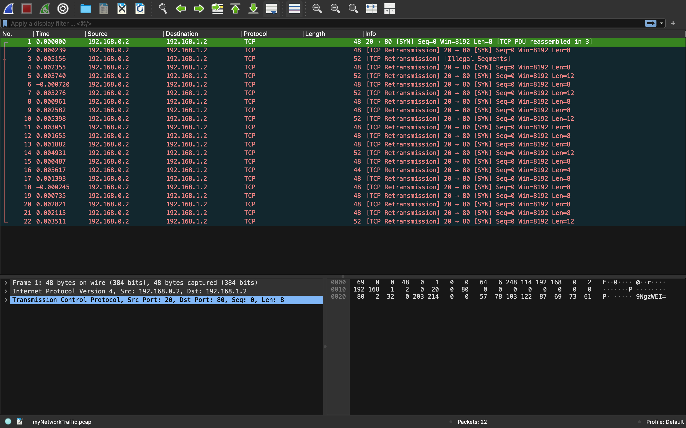
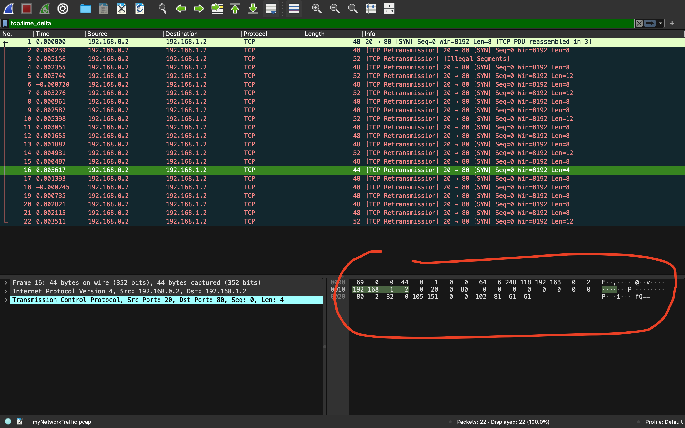

# DISKO 1

- **Category:** [Forensics]
- **Difficulty:** Easy
- **Description:** A digital ghost has breached my defenses, and my sensitive data has been stolen! 😱💻 Your mission is to uncover how this phantom intruder infiltrated my system and retrieve the hidden flag. To solve this challenge, you'll need to analyze the provided PCAP file and track down the attack method. The attacker has cleverly concealed his moves in well timely manner. Dive into the network traffic, apply the right filters and show off your forensic prowess and unmask the digital intruder!

## 1. Problem Analysis

In this challenge we are given a PCAP file that we need to download and analyze to find the flag hidden within it. To analyze the PCAP file, we can use a tool called `Wireshark` or we can use the terminal application `tcpdump`. In this case we will use `wireshark` since it has a GUI and is an industry standard for analyzing PCAP files.

## 2. Approach

To solve this challenge, we first install `wireshark`, you can install using the command `sudo apt install wireshark` if you are using a linux machine and if you are using a windows or mac machine you can download it from the [wireshark website](https://www.wireshark.org/download.html). After that you can load the PCAP file into `wireshark` and start analyzing it.

When you open the file, you should see the following information:



After we load the file, we can see all the information about the packets, the source and destination IP addresses, the protocols, the lengths, and the data that was sent.

When we look at the challenge description, it mentions that the attacker has concealed his moves in a well-timed manner. That tells us that we need to focus on the timing of the packets and we need to filter and sort the packets based on their timestamps.

To do that, let's first sort the packets in ascending order based on their timestamps. To do that, we can click on the `Time` column header and it will sort the packets based on their timestamps. After that, let's look at the data that was sent in each packet:



When we look at the data that was sent, we can see that there is quite a lot of data that was sent in the packets. If we look closer at the last several packets, we can see that each one contains a base64 encoded string. That could be a potential flag. Let's look at the last 7 packets and extract the base64 strings from them. They give us the following strings:

```
cGljb0NURg==
ezF0X3c0cw==
bnRfdGg0dA==
XzM0c3lfdA==
YmhfNHJfYQ==
ZjE2MDk4MA==
fQ==
```

Now that we have the base64 strings, we can decode them to see if they give us the flag. Let's use our trusted tool `CyberChef` to decode them. You can access it [here](https://gchq.github.io/CyberChef/). After decoding the base64 strings, we get the flag.

## 3. Vulnerability

The vulnerability in this challenge is that the attacker has hidden the flag in the packets by encoding it in base64. Hiding information in packets across a network is a common technique used by attackers to exfiltrate data without being tracked. This can be dangerous, as it can lead to data breaches and loss of sensitive information, especially if the data is not properly encrypted and the attacker knows how to exploit the network traffic like we did in this challenge.

## 4. Flag

After decoding the base64 strings, we get the flag, `PicoCTF{******************************}`.

## 5. Key Takeaways

- **Understand network traffic and how to analyze it.**
- **Learn how to use wireshark to analyze PCAP files.**
- **Learn how to filter and sort packets based on their timestamps.**
- **Learn how to extract data from packets and decode it.**
